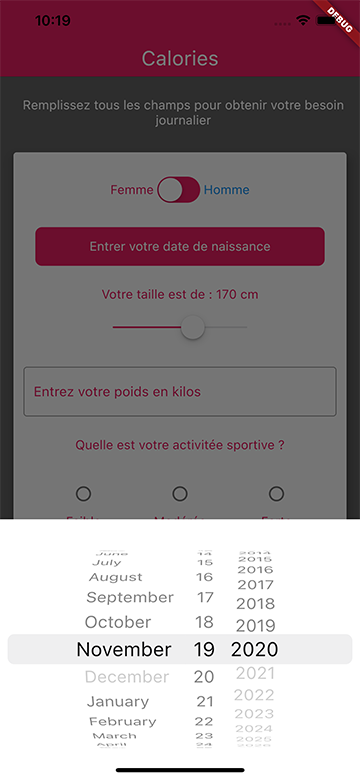
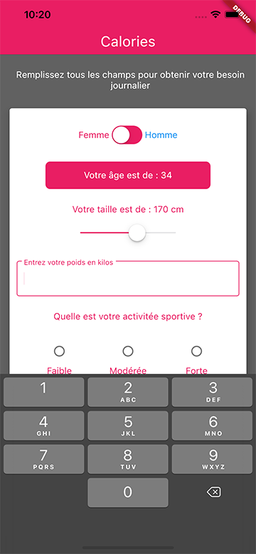
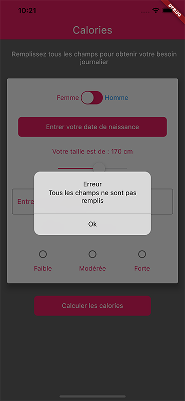
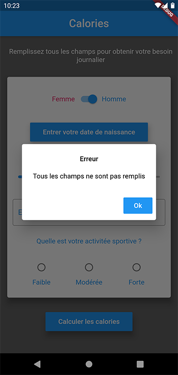
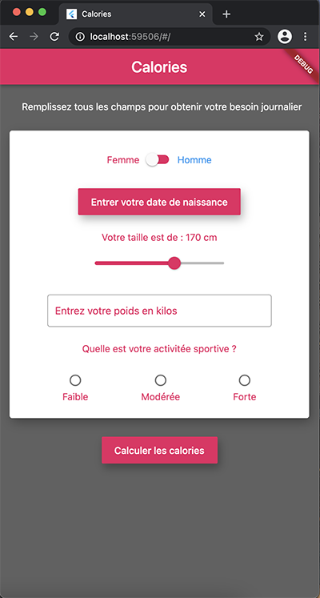
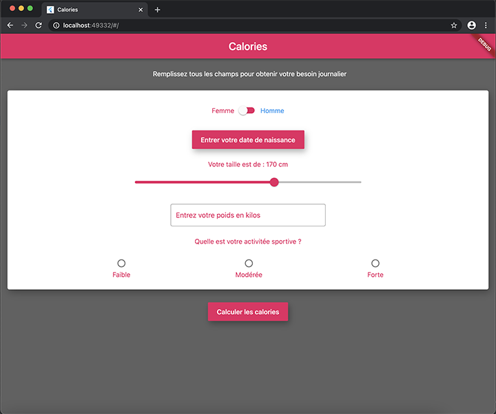

# Calories

A simple application designed with Flutter to test flutter web and the ability to detect different platforms and thus adapt widgets.

## Description

A simple Flutter app that gives you the amount of calories you need by day according your physical activity.

Training to use :

    - Cupertino widgets
    - Responsive web design
    - Callback with parent widget

## Run on  

    -Web
    -Android
    -IOS

## Screenshots

### IOS version with Cupertino widgets

### Android version with Material widgets

### Web version with responsive Material widgets

